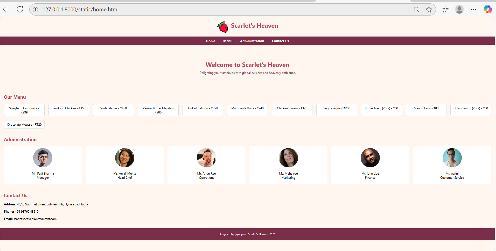

# Ex.07 Restaurant Website
## Date:06/10/2025

## AIM:
To develop a static Restaurant website to display the food items and services provided by them.

## DESIGN STEPS:

### Step 1:
Requirement collection.

### Step 2:
Creating the layout using HTML and CSS.

### Step 3:
Updating the sample content.

### Step 4:
Choose the appropriate style and color scheme.

### Step 5:
Validate the layout in various browsers.

### Step 6:
Validate the HTML code.

### Step 7:
Publish the website in the given URL.

## PROGRAM:
```
home.html

<!DOCTYPE html>
<html lang="en">
<head>
  <meta charset="UTF-8">
  <meta name="viewport" content="width=device-width, initial-scale=1.0">
  <title>Scarlet's Heaven</title>
  <style>
    body {
      font-family: 'Segoe UI', Tahoma, Geneva, Verdana, sans-serif;
      margin: 0;
      padding: 0;
      background-color: #fff6f0;
    }
    header {
      background-color: #fff6f0;
      padding: 20px;
      text-align: center;
    }
    header img {
      height: 60px;
      vertical-align: middle;
    }
    header h1 {
      display: inline;
      font-size: 2em;
      color: #c14461;
      margin-left: 10px;
    }
    nav {
      background-color: #7a2e47;
      display: flex;
      justify-content: center;
      padding: 10px 0;
    }
    nav a {
      color: white;
      text-decoration: none;
      margin: 0 20px;
      font-size: 1.1em;
      font-weight: bold;
    }
    nav a:hover {
      text-decoration: underline;
    }
    .banner {
      background-image: url('https://images.unsplash.com/photo-1555992336-03a23cbe45ae');
      background-size: cover;
      background-position: center;
      color: white;
      padding: 60px 20px;
      text-align: center;
      border-radius: 10px;
      margin: 20px;
    }
    .banner h2 {
      font-size: 2em;
      margin: 0 0 10px;
    }
    .banner p {
      max-width: 600px;
      margin: 0 auto;
    }
    .cards {
      display: flex;
      justify-content: space-around;
      flex-wrap: wrap;
      margin: 20px;
    }
    .card {
      background-color: #fde3e0;
      border-radius: 10px;
      padding: 20px;
      width: 300px;
      margin: 10px;
      box-shadow: 0 2px 5px rgba(0,0,0,0.1);
    }
    .card img {
      width: 100%;
      border-radius: 10px;
    }
    .card h3 {
      margin-top: 10px;
    }
    .menu-section, .admin-section, .contact-section {
      margin: 40px 20px;
    }
    .menu-section h2, .admin-section h2, .contact-section h2 {
      color: #c14461;
    }
    .menu-grid {
      display: grid;
      grid-template-columns: repeat(auto-fit, minmax(200px, 1fr));
      gap: 20px;
    }
    .menu-item {
      background: #fff;
      border: 1px solid #ddd;
      border-radius: 10px;
      padding: 10px;
      text-align: center;
    }
    .admin-grid {
      display: grid;
      grid-template-columns: repeat(auto-fit, minmax(150px, 1fr));
      gap: 20px;
    }
    .admin-card {
      background: #fff;
      border-radius: 10px;
      padding: 10px;
      text-align: center;
    }
    .admin-card img {
      border-radius: 50%;
      width: 100px;
      height: 100px;
    }
    footer {
      text-align: center;
      padding: 20px;
      background-color: #7a2e47;
      color: white;
      font-size: 0.9em;
    }
  </style>
</head>
<body>
  <header>
    
    <h1>Scarlet's Heaven</h1>
  </header>
  <nav>
    <a href="#">Home</a>
    <a href="#menu">Menu</a>
    <a href="#admin">Administration</a>
    <a href="#contact">Contact Us</a>
  </nav>
  <section class="banner">
    <h2 style="color: #c14461;">Welcome to Scarlet's Heaven</h2>
    <p style="color: #7a2e47;">Delighting your tastebuds with global cuisines and heavenly ambiance.</p>
  </section>

  <section class="menu-section" id="menu">
    <h2>Our Menu</h2>
    <div class="menu-grid">
      <div class="menu-item">Spaghetti Carbonara - ₹299</div>
      <div class="menu-item">Tandoori Chicken - ₹350</div>
      <div class="menu-item">Sushi Platter - ₹450</div>
      <div class="menu-item">Paneer Butter Masala - ₹280</div>
      <div class="menu-item">Grilled Salmon - ₹550</div>
      <div class="menu-item">Margherita Pizza - ₹240</div>
      <div class="menu-item">Chicken Biryani - ₹320</div>
      <div class="menu-item">Veg Lasagna - ₹260</div>
      <div class="menu-item">Butter Naan (2pcs) - ₹60</div>
      <div class="menu-item">Mango Lassi - ₹80</div>
      <div class="menu-item">Gulab Jamun (2pcs) - ₹50</div>
      <div class="menu-item">Chocolate Mousse - ₹120</div>
    </div>
  </section>

  <section class="admin-section" id="admin">
    <h2>Administration</h2>
    <div class="admin-grid">
      <div class="admin-card">
        
        <p>Mr. Ravi Sharma<br>Manager</p>
      </div>
      <div class="admin-card">
        
        <p>Ms. Anjali Mehta<br>Head Chef</p>
      </div>
      <div class="admin-card">
        
        <p>Mr. Arjun Rao<br>Operations</p>
      </div>
      <div class="admin-card">
        
        <p>Ms. Meha roe<br>Marketing</p>
      </div>
      <div class="admin-card">
        
        <p>Mr. john doe<br>Finance</p>
      </div>
      <div class="admin-card">
        
        <p>Ms. nalini <br>Customer Service</p>
      </div>
    </div>
  </section>

  <section class="contact-section" id="contact">
    <h2>Contact Us</h2>
    <p><strong>Address:</strong> 45/3, Gourmet Street, Jubilee Hills, Hyderabad, India</p>
    <p><strong>Phone:</strong> +91 98765 43210</p>
    <p><strong>Email:</strong> scarletsheaven@restaurant.com</p>
  </section>

  <footer>
    Designed by Iyyappan | Scarlet's Heaven | 2025
  </footer>
</body>
</html>

```

## OUTPUT:



## RESULT:
The program for designing software company website using HTML and CSS is completed successfully.
